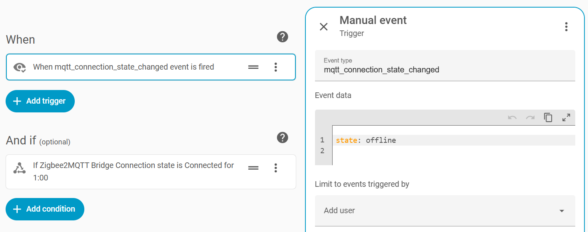
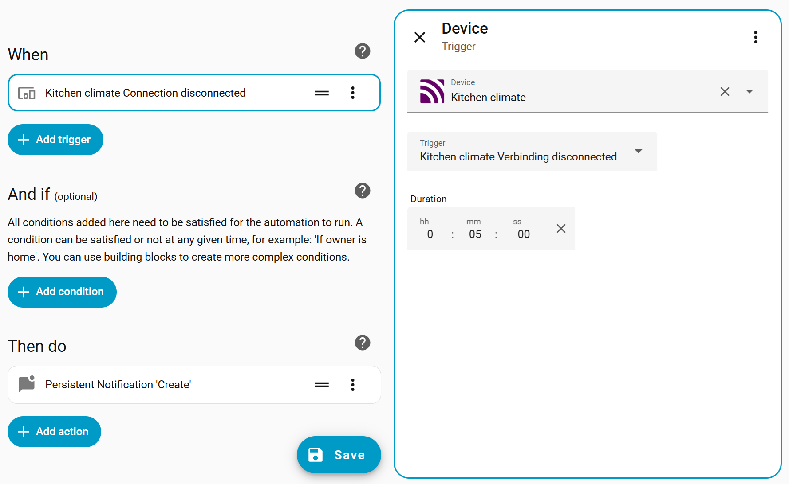
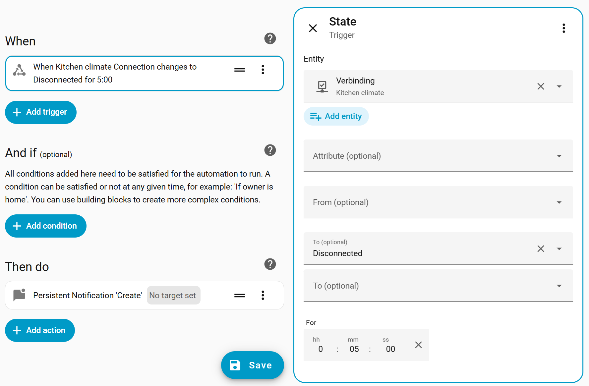
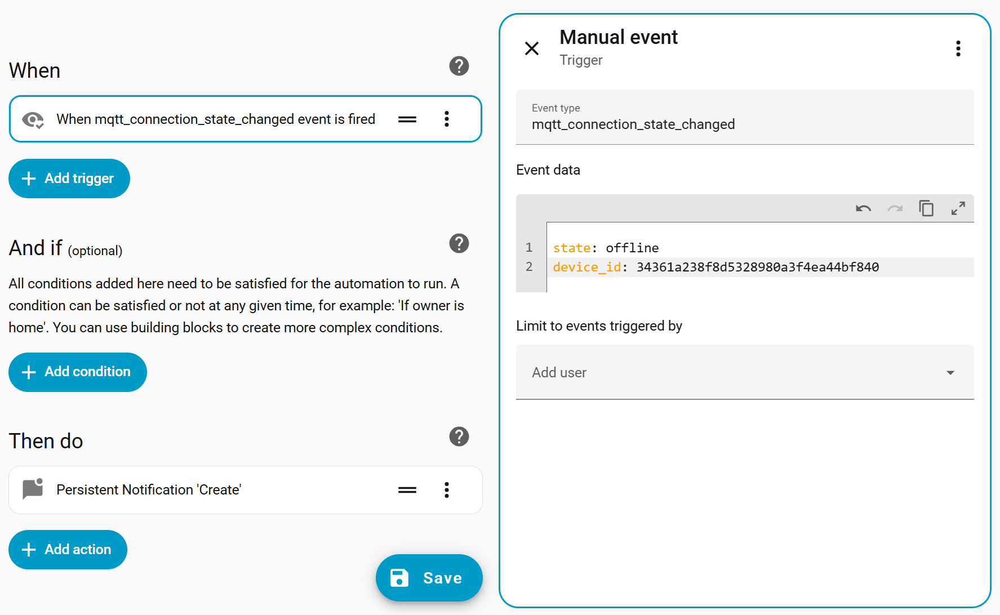

# 🔌 MQTT Connection State

This custom integration creates a diagnostic sensor for MQTT devices that shows the **MQTT connection state** based on a device’s MQTT *availability* or *state* topic.

> [!TIP]
> If you have any questions or feedback, find me on the Home assistant community: [studioIngrid](https://community.home-assistant.io/u/studioingrid). \
> Or reply in the [thread](https://community.home-assistant.io/t/add-connection-state-online-offline-to-every-z2m-device-or-other-mqtt-device).

## What it can do ✅

It can:

* 🔍 **Discover** MQTT devices with connection topics
* 🔄 **Auto-update** when device information or topics change
* 🚨 Detect and clean up **duplicate entries** left by device-registry migrations
* ⚡ Use **actions** for bulk setup in new installs
* 🔔 Easily trigger **notification automations** using events

## 🔗 Quick Go To

* [Installation](#-installation)
* [Features](#-features)
* [Actions](#%EF%B8%8F-actions)
* [Automation ideas](#-automation-ideas)

## 📦 Installation

### 🧩 HACS

* Open the HACS dashboard (`/hacs/dashboard`)
* Menu (⋮) → **Custom repositories**
* Add repository:

```
https://github.com/studioIngrid/mqtt_connection_state
```

Type: `integration`

* Click *Add*, then close the popup
* Search for: `MQTT connection state`
* Click *Download* (bottom right)
* Restart Home Assistant
* Go to *Settings* → *Devices & Services* → *Helpers*
* Manually add the first device:
   *Create Helper* → search for *MQTT connection state* → *Select a device*
* Newly discovered devices should appear within ~10 minutes
* For configuring multiple devices, see [Actions](#actions)

### 🛠️ Manual

HACS is recommended, as it provides update notifications.

* Download this repository
* Copy it to:
  `config/custom_components/mqtt_connection_state`
* Restart Home Assistant
* Add the first device as described above

### 🐝 Zigbee2MQTT

Availability is **disabled by default** in Zigbee2MQTT.
If no availability topic is published, the device will **not** be discovered.

Enable availability via the **web UI** or `configuration.yaml`.
Official docs:
[https://www.zigbee2mqtt.io/guide/configuration/device-availability.html](https://www.zigbee2mqtt.io/guide/configuration/device-availability.html)

#### Short version

**Z2M add-on users**
Zigbee2MQTT web UI → *Settings* → *Settings tab* → *Availability* → enable
Restart the add-on.

**Z2M Docker users**: Edit `configuration.yaml` and add or update:

```yaml
availability:
  enabled: true
```

After enabling this, availability topics will be published and devices can be discovered correctly ✅.

> 💡 **Tip — keep “last seen” available even when a device is offline**
> Add or update the following in `configuration.yaml` of your zigbee instance:
>
> ```yaml
> device_options:
>   homeassistant:
>     last_seen:
>       enabled_by_default: true
>       availability: []
> ```

### 🌐 Other MQTT devices

The integration determines the connection state by evaluating **state messages** published to MQTT. The payload may be either:

* A **plain string**, or
* A **JSON object** containing one of the following keys:

  * `state`
  * `status`
  * `availability`

The following values are treated as **online** (case-insensitive):

`true`, `online`, `on`, `1`

All other values are **offline**.

#### Examples

Plain string:

```
online
```

JSON payload:

```
{
  "state": "online"
}
OR
{
  "availability": "true"
}
```

> 💬 **Feedback welcome**
> If your device publishes availability or state messages in a different format, please open an issue or share an example payload (found in the debug log, so support can be improved.

## ✨ Features

### 🔍 Automatic Discovery

* Periodically scans the device registry for MQTT devices with availability or status topics
* If multiple topics are found, the last one is used

### 🚨 Duplicate Detection & Repairs

* Detects duplicate config entries that point at the same MQTT device
  (e.g. left behind by Home Assistant's 2026.8 device-registry migration)
* Raises a fixable **Repair issue** showing how many can be removed
* Clean them up in one click from the Repair, or run the
  `mqtt_connection_state.remove_duplicate_entries` action
  (`dry_run` defaults to a safe preview; set `dry_run: false` to remove)

### 🧩 Entity Behavior

Each device gets one entity: `binary_sensor.<device_name>_connection_state`

* Entity values can be translated to the users defined language
* Entity names are translated to the server general language
* Currently supported languages: **EN**, **NL**, **SV** and **DE**

### ⚡ Bulk setup

Automatically completes setup for discovered devices, avoiding repetitive clicking.
Use actions to list devices and confirm them in bulk. See [Actions](#actions).

### 🔔 Events

An event is fired on **every connection state change**, enabling flexible and scalable automations.

Example of event format:

```
event_type: mqtt_connection_state_changed
data:
  topic: zigbee2mqtt/livingroom_motion/availability
  state: offline
  device_id: c940be963f2b3080a1d48fc5f9973298
  device_name: Livingroom motion
  entity_id: binary_sensor.livingroom_motion_connection_state
```

## ⚙️ Actions

### 📋 List New Devices

When you first install the integration, you may have **many devices** to add.
This action returns a list of newly discovered devices, which you can then use for bulk setup with *Add new devices*.

Example response:

```
new_devices: |-
  [
    {
      "id": "c940be963f2b3080a1d48fc5f9973298",
      "name": "Livingroom motion"
    },
    {
      "id": "bf3414747ac5107f90f389a78420ece3",
      "name": "Livingroom climate"
    },
  ]
```

To prepare this list as input for *Add new devices*.

### ➕ Add New Devices

This action can only be performed by **admins**. And only **previously discovered devices** can be bulk added.

The required input is a JSON string (format shown below).
Only the `"id"` field is used; all other attributes are ignored.

```
  [
    {
      "id": "c940be963f2b3080a1d48fc5f9973298",
    },
    {
      "id": "bf3414747ac5107f90f389a78420ece3",
      "name": "Livingroom climate" <------ # optional, will be ignored
    },
  ]
```

#### 🧪 Prepare Output from *List new devices*

Notes on JSON formatting:

* In JSON indentation is not important
* Brackets and commas are important
* Remove the first line: `new_devices: |-`
* Remove unwanted devices from `{` to `},`
* JSON does not allow trailing commas
* You can validate your JSON using a tool like [curious concept JSON formatter](https://jsonformatter.curiousconcept.com/)
  (enable **fix JSON** to remove trailing commas)
* If using an LLM, note that the string will be evaluated using Python’s `json.loads()`

## 🔔 Automation ideas

To get notified when devices go offline or come back online, you can create automations based on **events**.
This integration fires an event on **every connection state change**, which makes event-based automations the most flexible and scalable approach.

You can use these fields directly in triggers for automations.

### 📩 Basic notifications for offline devices

Create an automation triggered by the `mqtt_connection_state_changed` event.

Event type:

```
mqtt_connection_state_changed
```

Event data:

```
state: offline
```



Example automation:

```
alias: "Notify conecction state offline"
description: "Using the mqtt_conecction_state events for monitoring"
mode: parallel
max: 50
trace:
  stored_traces: 50
triggers:
  - trigger: event
    event_type: mqtt_connection_state_changed
    event_data:
      state: offline
conditions: []
actions:
  - alias: Report offline devices in HA notifications
    action: persistent_notification.create
    data:
      title: Device offline
      message: >-
        {{ trigger.event.data.device_name }} went offline</br></br>
        <small><a href="/config/devices/device/{{ trigger.event.data.device_id }}">Device</a></small></br>
        <small>{{ now()  | as_timestamp | timestamp_custom('%H:%M') }}</small>
  - alias: If important device send notification to phone
    if:
      - condition: template
        value_template: >-
          
          {{ trigger.event.data.entity_id in important_devices }}
    then:
      - action: notify.mobile_app_iphone
        data:
          title: Device offline
          message: "{{ trigger.event.data.device_name }} went offline"
```

### 🎯 Automations for a specific device

If you only want to monitor a specific device, you can choose from multiple trigger types depending on your preference and use case.

#### Device trigger

Use the device trigger when you prefer selecting the device through the UI and keeping the automation device-centered.



#### Entity trigger

Use the entity trigger if you want easy to read YAML.



#### Event trigger

Use an event trigger and include a unique identifier such as `device_id` or `entity_id` in the event data as a filter.

Example event data:

```
state: offline
device_id: c940be963f2b3080a1d48fc5f9973298
```


